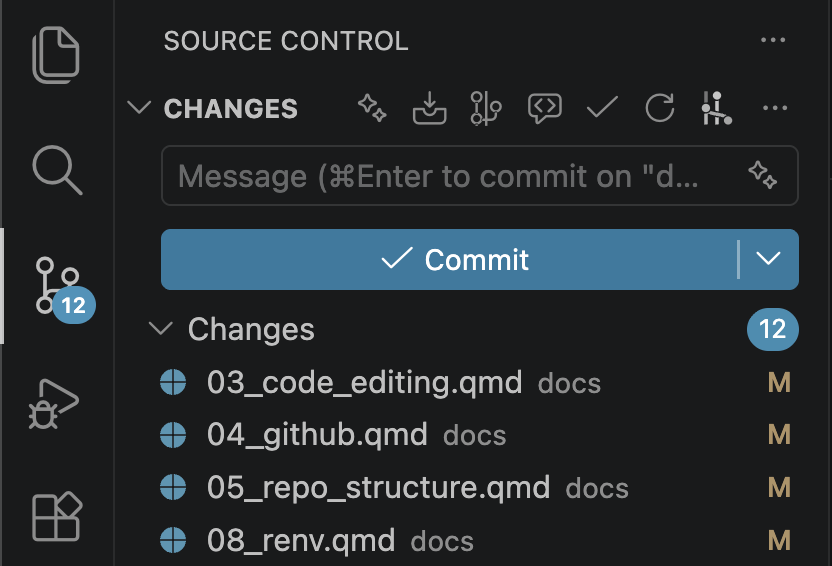
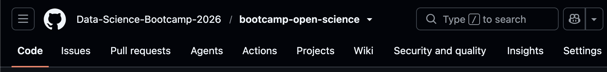

## GitHub

GitHub is a cloud-based platform that hosts Git projects (called repositories aka repo's). There are alternatives like GitLab and Bitbucket, but GitHub is the most popular, especially for personal projects.

## Remote vs. local

![Remote repo vs. local repo [@weberpals2025lets]](assets/images/remote_local.png){width=400px}

There is a **remote** version of the repo that is stored in the cloud by GitHub (Git denotes the remote repo with the prefix `origin/`). There is also a **local** version of the repo that is stored in your computer (no prefix). If you have collaborators, they will have their own local version stored in their computer. These versions may be out of sync, by design, so that collaborators can work on the same project simultaneously without causing conflicts. These versions talk to each other by *pushing* code up (from local → remote) and *pulling* it down (from remote → local).

## Typical workflow

Suppose you make a change in a file locally. You can always just click **Save** and the changes will be saved. But that does not create a traceable snapshot of changes over time. When you reach a stable version of the code, you should create a snapshot of it so that if any changes afterwards break the code, you have something to fall back on.

1. **Stage:** select the changes that you want to snapshot
2. **Commit:** snapshot the changes and add a 'commit message' that describes the changes
3. **Push:** upload the changes to the remote repo

Your snapshots are known as your commit history.

If the remote repo is ahead of your local repo, then you need to sync it. There are different ways to do this:

- **Clone:** use when you first start; create a local copy of the repo
- **Pull:** use while working on an existing project; downloads changes, typically from the remote repo (it is a two-step process: first it "fetches" the changes to see what is new, then it "merges" the changes in)

## Setup

It is easier to create a repo on GitHub and then clone it, than it is to start a repo locally then push it:

1. Go to [GitHub](https://github.com/)
2. Click the green **New** button
3. Give the repository a name, typically lowercase words separated by hyphens
4. Provide a brief description

Next are some customizable starting options. You can change these later, but this is a good start for your first repo in R. More about these in the [next chapter](05_repo_structure.qmd)

5. **Choose visibility:** Private
6. **Add README:** On
7. **Add .gitignore:** R
8. **Add license:** MIT License
9. Click the green **Create repository** button

Now, clone the repo:

10. Copy the HTTPS URL
11. Open VS Code
12. Click the search bar
13. Click **Show and Run Commands >**
14. Click **Git: Clone** (if it does not show up, start typing it in to bring it up)
15. Paste the URL and hit Enter
16. Save it; as long as the repo uses relative paths, it generally does not matter where you save it

## Working

17. Do what you normally do, creating files and folders in RStudio, VS Code, and/or File Explorer (Windows) or Finder (macOS)
18. Amend the `README`, `LICENSE`, and `.gitignore` as needed -- more about these in the [next chapter](05_repo_structure.qmd)

When you reach a stable version of the project:

19. On VS Code, click the **Source Control** button on the sidebar

{width=400px}

20. Stage changes by hovering your pointer over the files and click the `+` symbol; if you want to stage all, hover your pointer over the the **Changes** row and click its `+` symbol
21. Commit changes by providing a brief commit message in the free text field and clicking the blue **Commit** button
22. Push changes by clicking the blue **↑ Sync changes** button; if you do not see it (likely because you did not stage all changes), hover your pointer over the **CHANGES** row and click its `...` symbol, then click **Push**

## Returning

::: {.callout-note}
## **Note**
Almost all the steps above use the graphical user interface (GUI) rather than typing git commands in the terminal (command-line interface (CLI)). It is possible to do all these steps through the terminal, but that is outside the scope of this bootcamp.
:::

## Repository structure

## Private vs. public

## 

## Glossary

## GitHub Copilot

::: {.content-visible when-format="html"}
## References
:::
